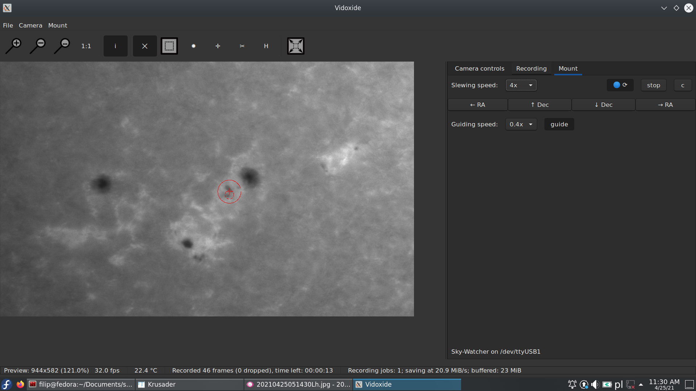

# Vidoxide
Copyright (C) 2020-2024 Filip Szczerek (ga.software@yahoo.com)

*This program is licensed under MIT license (see LICENSE.txt for details).*

----------------------------------------

- 1\. Introduction
- 2\. Features
- 3\. Building
  - 3\.1\. Linux and alikes
  - 3\.2\. MS Windows
- 4\. Troubleshooting

----------------------------------------



## 1. Introduction

Vidoxide is a video capture tool with features targeted at Solar System astrophotographers.

Demonstration video: [link](https://www.youtube.com/watch?v=7s_nibrTrsU)


## 2. Features

**Cross-platform**
  - Builds & runs on any platform supporting Rust and GTK

**Supported camera APIs:**
  - IIDC (DC1394); multiplatform
  - FlyCapture2 (FLIR, formerly Point Grey); multiplatform
  - Spinnaker (FLIR); multiplatform
  - ASICamera2 (ZWO); multiplatform
  - Video4Linux2 – extremely basic support (only YUYV video modes, no camera controls); Linux only

**Supported telescope mounts:**
  - Sky-Watcher direct serial connection (tested with a 2014 HEQ5), multiplatform
  - iOptron direct serial connection, multiplatform
  - ASCOM (tested with ASCOM/EQMod and a 2014 HEQ5), MS Windows only

**Image feature tracking:**
  - self-guiding (with supported mounts): selected image feature (or a planet – via centroid) stays in the same place of the FOV
  - live crop: only a ROI around a selected image feature is recorded
  - preview stabilization (e.g., for focusing in windy conditions)

**Game controller support:**
  - slewing the mount
  - other actions (upcoming)

**Dispersion indicator**: helps to adjust an Atmospheric Dispersion Corrector down to 0.1-pixel accuracy (of R-G, B-G channel offset)

**Collimation helper**: shows a live stack of a star image to aid collimation in less-than-perfect seeing conditions

**Output formats:**
  - TIFF or BMP image sequence
  - SER video
  - *upcoming:* AVI video


## 3. Building

Clone the repository:
```Bash
$ git clone --recurse-submodules https://github.com/GreatAttractor/vidoxide.git
```

Camera drivers to build are selected as features in invocation of `cargo`, e.g.:
```Bash
$ cargo build --release --features "camera_iidc camera_v4l2 camera_flycap2 camera_spinnaker camera_asi"
```
will build Vidoxide with the IIDC, V4L2, FlyCapture 2, Spinnaker and ASI drivers.


### 3.1. Linux and alikes

Install the [Rust toolchain](https://www.rust-lang.org/learn/get-started). C & C++ toolchain is also required, as are GTK3 development libraries, and those needed by camera drivers you wish to use.

*Detailed instructions: to be provided.*
prerequisites (Fedora): `libusb-devel`, `libudev-devel`, `lib1394-devel`
(V4L2 needs (on Fedora): `llvm-devel`, `clang`)


### 3.2. MS Windows

Building under MS Windows has been tested in [MSYS2](https://www.msys2.org/) environment and the GNU variant of the [Rust toolchain](https://www.rust-lang.org/learn/get-started).

Download MSYS2 from http://www.msys2.org/ and follow its installation instructions. Then install the Rust toolchain: go to https://forge.rust-lang.org/infra/other-installation-methods.html and install the `x86_64-pc-windows-gnu` variant. The warnings about "Visual C++ prerequisites" being required and "Install the C++ build tools before proceeding" can be ignored. Note that you must customize "Current installation options" and change the "default host triple" to "x86_64-pc-windows-gnu".

Open the "MSYS2 MinGW 64-bit" shell (from the Start menu, or directly via `C:\msys64\msys2_shell.cmd -mingw64`), and install the build prerequisites:
```bash
$ pacman -S git base-devel mingw-w64-x86_64-toolchain mingw-w64-x86_64-gtk3
```

From now on it is assumed that FlyCapture2 and Spinnaker camera APIs are to be used. Download and install the FlyCapture2 & Spinnaker SDKs, go to the location of FC2 binaries (by default, "C:\Program Files\Point Grey Research\FlyCapture2\bin64") and check if the `FlyCapture2_C.dll` file exists. If not, make a copy of the corresponding versioned file (e.g., `FlyCapture2_C_v100.dll`) in the same location and rename it `FlyCapture2_C.dll` (this is required due to the `libflycapture2-sys` crate's expectations).

Pull Rust binaries into `$PATH`:
```bash
$ export PATH=$PATH:/c/Users/MY_USERNAME/.cargo/bin
```
then change to the Vidoxide source directory and build it:
```bash
$ SPINNAKER_LIBDIR="C:\Program Files\FLIR Systems\Spinnaker\bin64\vs2015" FLYCAP_LIBDIR="C:\Program Files\Point Grey Research\FlyCapture2\bin64" ASICAMERA_LIBDIR="C:\Downloads\ASI SDK\lib\x64" cargo build --release --features "camera_flycap2 camera_spinnaker mount_ascom"
```
Initially it will take several minutes, as all dependencies have to be downloaded and built first. Note that the location of FC2 DLLs must be given in `FLYCAP_LIBDIR`, Spinnaker DLLs in `SPINNAKER_LIBDIR`, and ASI DLL in `ASICAMERA_LIBDIR`.

After a successful build, Vidoxide can be run locally with:
```bash
$ PATH="$PATH:C:\Program Files\Point Grey Research\FlyCapture2\bin64:C:\Program Files\FLIR Systems\Spinnaker\bin64\vs2015:C:\Downloads\ASI SDK\lib\x64" target/release/vidoxide.exe
```

*Upcoming: creating a binary distribution*


## 4. Troubleshooting

#### Unable to switch camera to a 16-bit video mode under Linux

Increase the USB-FS buffer size, e.g. (run as root):
```
# echo 1000 > /sys/module/usbcore/parameters/usbfs_memory_mb
```
